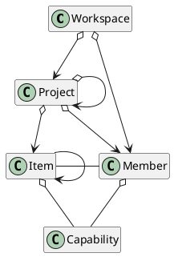

# summary

project (task / item) management. scrum?
github/gitlab cooperator

API/GUI/CLI mcp?

# concept

workspace (organization)
single user - single workspace, user can't see workspace
saas - each organization have their own workspace, user shall login to a single workspace, workspace maintains its own member list. a user may be contained by multiple orgain (workspace), they may be unigue user, have unique username/password, but, as a member of a workspace, they're totally independent. they could be same or different role in different workspace, for example, user Tom may be developer as workspace a, but product owner workspace b. when Tom login, he/she should select workspace first, or login in specific workspace first (that means, workspace may have its own login url. in this way, how/when shall we create a new user?)

project is base object under workspace manabed by this system. shall we manage project group? where is epic/milestore etc?

workspace manages member list. member has its own ability list.

admin - 
project manager, project leader, product owner, QA, developer, IT/devops

developer - frontend developer, backend developer
QA - automation test, manual test

position / role

item - base object managed by project, normally, it's an issue, bug, feature, it assigned to one( or many?) member. item has status, status maintained by workflow. item could have sub item. item level could be nest

workflow: finit state machine. one/more start point/status. one/more final point/status. it must start at start point, and end at final point. 
workspace may maintain some predefined workflow, project introduces workspace, and can tune to satisfy its own requirement. also, project may uses multiple workflow, workflow can be assigned to item type: feature, bug. when create a new item, it could use a specify workflow. 

ergent items row: 有地方能显示地看到紧急加入的items，如处理线上故障等。这不只是优先级的问题，而是这是item可能不是用正常流程产生的，也不是正常流程处理
mark block items: 当当前item被block时，需要有办法能标记它们，使它们能很容易的被团队关注到

进展指示器：如何，何时以及在哪显示，我们需要能快速在看板和指示器直接切换显示

WIP：如何处理WIP的概念？如何设置WIP数量？每个member一个/2个WIP？

每日站会的作用：同步项目组内所有成员的状态，更主要的是发现当前阻塞点在哪，以便能尽快解决它

