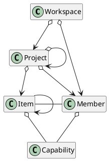

# summary

project (task / item) management. scrum?
github/gitlab cooperator

API/GUI/CLI mcp?

# concept

workspace (organization)
single user - single workspace, user can't see workspace
saas - each organization have their own workspace, user shall login to a single workspace, workspace maintains its own member list. a user may be contained by multiple orgain (workspace), they may be unigue user, have unique username/password, but, as a member of a workspace, they're totally independent. they could be same or different role in different workspace, for example, user Tom may be developer as workspace a, but product owner workspace b. when Tom login, he/she should select workspace first, or login in specific workspace first (that means, workspace may have its own login url. in this way, how/when shall we create a new user?)

project is base object under workspace manabed by this system. shall we manage project group? where is epic/milestore etc?

workspace manages member list. member has its own ability list.

admin - 
project manager, project leader, product owner, QA, developer, IT/devops

developer - frontend developer, backend developer
QA - automation test, manual test

position / role

item - base object managed by project, normally, it's an issue, bug, feature, it assigned to one( or many?) member. item has status, status maintained by workflow. item could have sub item. item level could be nest

workflow: finit state machine. one/more start point/status. one/more final point/status. it must start at start point, and end at final point. 
workspace may maintain some predefined workflow, project introduces workspace, and can tune to satisfy its own requirement. also, project may uses multiple workflow, workflow can be assigned to item type: feature, bug. when create a new item, it could use a specify workflow. 

ergent items row: 有地方能显示地看到紧急加入的items，如处理线上故障等。这不只是优先级的问题，而是这是item可能不是用正常流程产生的，也不是正常流程处理
mark block items: 当当前item被block时，需要有办法能标记它们，使它们能很容易的被团队关注到

进展指示器：如何，何时以及在哪显示，我们需要能快速在看板和指示器直接切换显示

WIP：如何处理WIP的概念？如何设置WIP数量？每个member一个/2个WIP？

每日站会的作用：同步项目组内所有成员的状态，更主要的是发现当前阻塞点在哪，以便能尽快解决它

2026-09-14：
- 项目看板增加 刷新 按钮，可以查看最新的item状态。可选项是定时自动更新，或websocket更新
- 获取 项目 列表页面中，每个项目都调用了feasibility api。这不是好的架构。是否可以在项目 表中增加冗余项，对于有不满足能力的item的project，加上不满足标记，在页面显示时也显示标记。这个冗余项可以在获取project 列表时更新（但安装CQRS的原则，应该是先发一条更新命令，再发获取列表命令
- 同上，项目主页中，每个item的不满足是否也可以这样做？
- item detail列表中，还是没有需要的能力的编辑入口和页面。
- 为什么调用了那么多unread-count api？

2026-09-19
- item detail页面中description部分，使用rich text，不要用text box，不要出现边框。后期，专门使用一个sprint来实现这个rich text box，包括编辑，和显示，具体需求后期讨论
- feasibility的创建和修改。
  - feasiblity设计成层次结构，如：
    - 后端
      - kotlin
      - java
      - grpc
    - 前端
      - ui设计
      - react
    - 测试
      - 自动化测试
      - 手动测试
    - 架构
    - 产品
    - 项目管理
    - 
- members页面显示不美观。结合feasiblity的层次结构，显示多层表头的表格，内部checkbox设置有无，或 spinbox （就是有数字，并有上下按钮）设置数字
- item detail页面，显示title，description，relationship，其它内容使用property sheet的形式，使用tab表头切换。把所有非必须关心的内容都集中在里面。确实显示comment tab
- item detail页面右边需要一个side bar，显示各种时间，类型，优先级等必要信息
- 项目列表显示的项目太多了。这本身不是问题，但我们最好能有办法筛选，排序什么的，并且项目可以有完成状态，优先显示未完成项目，点一个checkbox可以切换显示所有项目。
- 工作量编辑 页面有点丑，操作也比较笨拙，需要优化
- item的项目成员选择，是否需要加上限制？只有项目成员才能分配item，有进行中item的成员不能被移除？请grill
- 看板和甘特直接是否应该有关联？
- 还需要一个表格显示项目 item列表，可以方便查看。表格列可以被toggle选择
- 工时页面没有回看板的link
- 我们有sprint或epic的概念吗？现在YPJ项目有很多done状态item，这个可能已经影响进行中 item的显示来，我们要怎么处理？
- 我看到了收藏 按钮，但在哪里收藏项目
- 未分配item使用特定颜色显示，每个 item member分配一个颜色，分配给该member的item使用该颜色。问题：是否不同状态也需要不同颜色？已超期或快超期 item是否需要用颜色标记
- github集成很重要，但我还没有亲自测试过。你再仔细分析还有哪些gap
